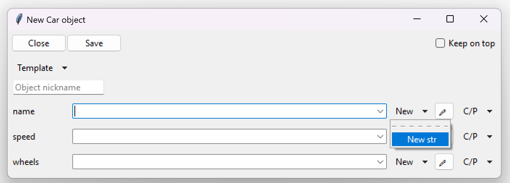

=========================================================
TkClassWizard
=========================================================
TkClassWizard - define objects graphically based on class annotations.
The library allows users to create abstract "ObjectInfo" objects based on the class's parameters, which
can later be converted to real Python objects and vice versa.

---------------------
Links
---------------------
- `Releases <https://github.com/davidhozic/TkClassWizard/releases>`_
- Need help? Contact me in my `Discord server <https://discord.gg/DEnvahb2Sw>`_.
- **DOCUMENTATION**: https://tkclasswizard.readthedocs.io/

---------------------
Main features
---------------------
- Interactive definition of Python objects based on annotations.
- Tkinter based
- JSON templates
- Polymorphism
- Generic classes
- Type aliases
- Data validation
- Conversion of defined data to Python objects and vice-versa.

----------------------
Installation
----------------------
TkClassWizard can be installed though command prompt/terminal using the bottom commands.
        
Pre-requirement: `Python (minimum v3.9) <https://www.python.org/downloads/>`_

.. code-block:: bash

    pip install tkclasswiz

----------------------
Example
----------------------

.. code-block:: python

    import tkinter as tk
    import tkinter.ttk as ttk
    import tkclasswiz as wiz

    # Normal Python classes with annotations (type hints)
    class Wheel:
        def __init__(self, diameter: float):
            self.diameter = diameter

    class Car:
        def __init__(self, name: str, speed: float, wheels: list[Wheel]):
            self.name = name
            self.speed = speed
            self.wheels = wheels

    # Tkinter main window
    root = tk.Tk("Test")

    # Modified tkinter Combobox that will store actual objects instead of strings
    combo = wiz.ComboBoxObjects(root)
    combo.pack(fill=tk.X, padx=5)

    def make_car(old = None):
        """
        Function for opening a window either in new definition mode (old = None) or
        edit mode (old != None)
        """
        assert old is None or isinstance(old, wiz.ObjectInfo)

        window = wiz.ObjectEditWindow()  # The object definition window / wizard
        window.open_object_edit_frame(Car, combo, old_data=old)  # Open the actual frame

    def print_defined():
        data = combo.get()
        data = wiz.convert_to_objects(data)  # Convert any abstract ObjectInfo objects into actual Python objects
        print(f"Object: {data}; Type: {type(data)}",)  # Print the object and it's datatype

    # Main GUI structure
    ttk.Button(text="Define Car", command=make_car).pack()
    ttk.Button(text="Edit Car", command=lambda: make_car(combo.get())).pack()
    ttk.Button(text="Print defined", command=print_defined).pack()
    root.mainloop()
