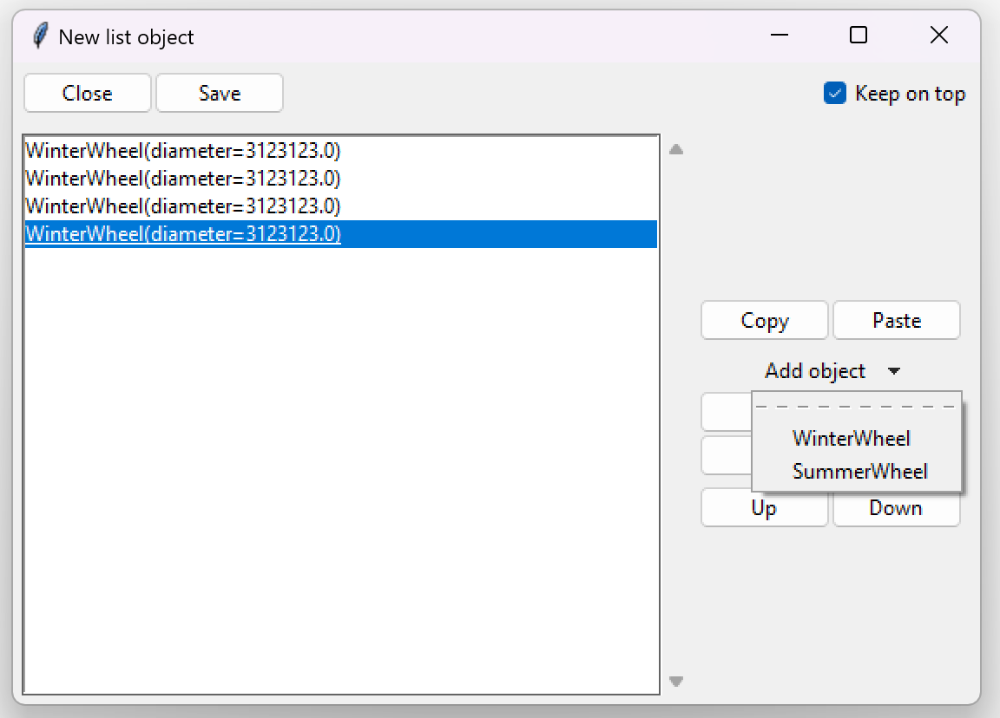

===================
Abstract classes
===================

Abstract classes in Object Oriented Programming (OOP) are classes that cannot be instantiated.
In Python, abstract classes can be by inheriting the :class:`abc.ABC` class. Abstract classes also need to have
abstract methods, otherwise Python will not treat the class as abstract. Trying to create an instance (object)
from an abstract class results in a TypeError exception.

.. code-block:: python

    from abc import ABC, abstractmethod

    class MyAbstractClass(ABC):
        @abstractmethod
        def some_method(self):
            pass

    class MyClass(MyAbstractClass):
        def some_method(self):
            return 5 * 5

    # OK
    my_instance = MyClass()

    # TypeError: Can't instantiate abstract class MyClass with abstract method some_method
    my_abstract_instance = MyAbstractClass()

Let's modify our example from :ref:`Polymorphism`.

.. code-block:: python
    :linenos:
    :emphasize-lines: 1, 8, 12

    from abc import ABC, abstractmethod

    import tkinter as tk
    import tkinter.ttk as ttk
    import tkclasswiz as wiz

    # An abstract class
    class Wheel(ABC):
        def __init__(self, diameter: float):
            self.diameter = diameter

        @abstractmethod
        def get_info(self) -> str:
            pass

    class WinterWheel(Wheel):
        def get_info(self) -> str:
            return "Wheel for winter."

    class SummerWheel(Wheel):
        def get_info(self) -> str:
            return "Wheel for summer."

    class Car:
        def __init__(self, name: str, speed: float, wheels: list[Wheel]):
            self.name = name
            self.speed = speed
            self.wheels = wheels

            if speed > 50_000:
                raise ValueError("Car can go up to 50 000 km / h")

            if len(wheels) != 4:
                raise ValueError("The car must have 4 wheels!")

    # Tkinter main window
    root = tk.Tk("Test")

    # Modified tkinter Combobox that will store actual objects instead of strings
    combo = wiz.ComboBoxObjects(root)
    combo.pack(fill=tk.X, padx=5)

    def make_car(old = None):
        """
        Function for opening a window either in new definition mode (old = None) or
        edit mode (old != None)
        """
        assert old is None or isinstance(old, wiz.ObjectInfo)

        window = wiz.ObjectEditWindow()  # The object definition window / wizard
        window.open_object_edit_frame(Car, combo, old_data=old)  # Open the actual frame

    def print_defined():
        data = combo.get()
        data = wiz.convert_to_objects(data)  # Convert any abstract ObjectInfo objects into actual Python objects
        print(f"Object: {data}; Type: {type(data)}",)  # Print the object and it's datatype

    # Main GUI structure
    ttk.Button(text="Define Car", command=make_car).pack()
    ttk.Button(text="Edit Car", command=lambda: make_car(combo.get())).pack()
    ttk.Button(text="Print defined", command=print_defined).pack()
    root.mainloop()

We can see that the ``Wheel`` is now an abstract class.
It is then inherited by ``WinterWheel`` and ``SummerWheel``.
If we try to define the ``wheels`` parameter of our ``Car`` object, only these two inherited classes
will be definable. 

We can see that while ``WinterWheel`` and ``SummerWheel`` are definable (due to :ref:`Polymorphism`),
``Wheel`` is not.
