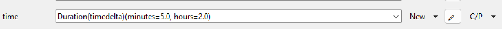
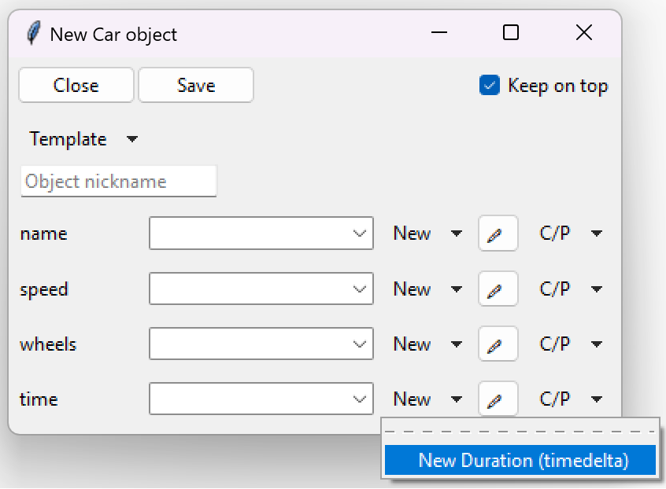

========================
Type aliasing
========================

TkClassWizard allows types to be aliased.
Alias is an alternative name or nickname for a specific type.

Type aliasing can be done within the :func:`tkclasswiz.aliasing.register_alias` function.
An alias can be obtained through :func:`tkclasswiz.aliasing.get_aliased_name` function.

For example, we can give the :class:`~datetime.timedelta` type an alternative name:

.. code-block:: python

    from datetime import timedelta
    import tkclasswiz as wiz

    wiz.register_alias(timedelta, "Duration")

If we define a type alias like in the above example, then the timedelta class will look like shown in the following 2 images:

    :class:`~datetime.timedelta` type alias display after definition of parameters.

|

    :class:`~datetime.timedelta` type alias display inside the New object menu.
