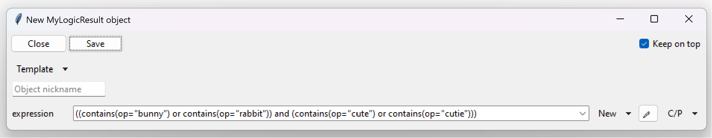

============================
Custom object display (repr)
============================

The default way of displaying objects is as follows: ``ClassName(param1=..., param2=..., param3=..., ...)``.
This printout / repr can b overridden with the use of :py:meth:`tkclasswiz.convert.ObjectInfo.register_repr` method.

.. automethod:: tkclasswiz.convert.ObjectInfo.register_repr
    :no-index:

For example, let's say I want to define some logical operators and want them to be displayed differently.
The example shows how a custom repr display can be made. It may look a bit much, but the only thing that matters
is the emphasized :py:meth:`~tkclasswiz.convert.ObjectInfo.register_repr` method call.
Inside the call, a lambda function is provided. The lambda accepts
the :class:`~tkclasswiz.convert.ObjectInfo` object and outputs a string.
That string is made up of the name of a logical operator and the operants in the following format:
``<op1> <operator name> <op2> <operator name> <op3> ...``. If the operator's name is ``or_op``, it will be displayed
as ``<op1> or <op2> or <op3> ...``. If the operator's name is ``and_op``, it will be displayed as 
``<op1> and <op2> and <op3> ...``.

.. code-block:: python
    :linenos:
    :emphasize-lines: 38-45

    from typing import List
    from abc import ABC, abstractmethod

    import tkinter as tk
    import tkinter.ttk as ttk
    import tkclasswiz as wiz

    class base_op(ABC):
        @abstractmethod
        def evaluate(self):
            pass

    class bool_op(base_op):
        def __init__(self, operants: List["base_op"]) -> None:
            self.operants = operants

    class and_op(bool_op):
        def evaluate(self):
            return all(op.evaluate() for op in self.operants)

    class or_op(bool_op):
        def evaluate(self):
            return any(op.evaluate() for op in self.operants)

    class contains(base_op):
        def __init__(self, op: str) -> None:
            pass

        def evaluate(self):
            # For demonstration purposes. Otherwise, we would usually check if op is contained within string
            return True

    class MyLogicResult:
        def __init__(self, expression: base_op) -> None:
            self.expression = expression

    wiz.ObjectInfo.register_repr(
        bool_op,
        lambda oi: "(" +
                f' {oi.class_.__name__.removesuffix("_op")} '
                .join(map(repr, oi.data["operants"])) +
                ")",
        True
    )

    # Tkinter main window
    root = tk.Tk("Test")

    # Modified tkinter Combobox that will store actual objects instead of strings
    combo = wiz.ComboBoxObjects(root)
    combo.pack(fill=tk.X, padx=5)

    def define(old = None):
        """
        Function for opening a window either in new definition mode (old = None) or
        edit mode (old != None)
        """
        assert old is None or isinstance(old, wiz.ObjectInfo)
        window = wiz.ObjectEditWindow()
        window.open_object_edit_frame(MyLogicResult, combo)

    # Main GUI structure
    ttk.Button(text="Open", command=define).pack()
    root.mainloop()

