====================================
Defining data
====================================

This is how our example from the previous page looks inside a GUI:

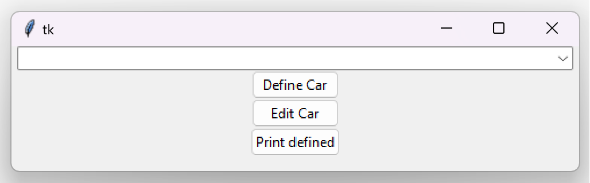

Defining structured data (objects)
=======================================

Now let's click on the **'Define Car'** button. Doing so will open up an object definition window:

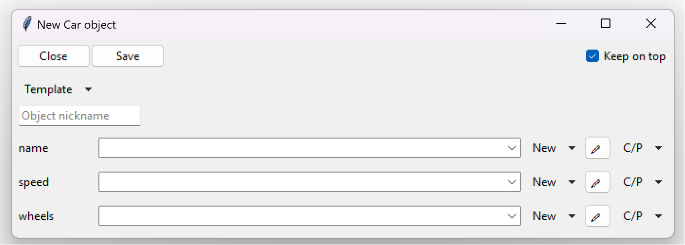

Looking at the above image, we can see a lot of stuff going on, so let's just go down from the top.
At the very top row we have 3 buttons:

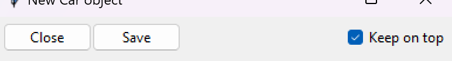

- "Close": This button causes the entire definition frame (page) to close.
  Since this is the very first level of our definition frames (pages), it will also close the entire window.
  If we were to change anything inside the frame, this button would first ask us if we want to save our changes.
- "Save": As the name suggests, this button will save all the defined data into the return widget, that was passed as
  parameter to the :py:meth:`~tkclasswiz.object_frame.window.ObjectEditWindow.open_object_edit_frame` method, which in
  our case was :class:`~tkclasswiz.storage.ComboBoxObjects` held by the ``combo`` variable.
  Finally the definition frame will be closed.
- "Keel on top": This button will keep the entire window on top of other windows, even if you clicked
  away. You can imagine it as a pin (on top) button.

Going downward we see a "Template" menu button, which allows us to either save the defined values into a JSON file, or
load them from a JSON file back into the GUI.

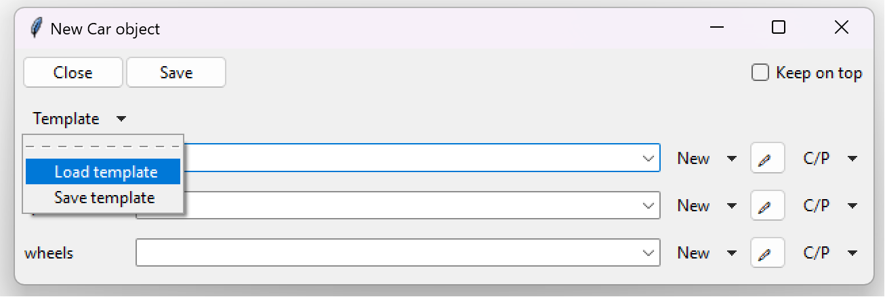

.. note::
    
    For verification purposes, the JSON file contains the full path to the defining class.
    Changing the class path requires users to update the corresponding path within the JSON files as well.

Below the "Template" button, an entry labeled "Object nickname" is located.
This entry can be used to give an object a nickname.
The nickname will be displayed before the class's name,
allowing the object to be easily recognized at a glance.

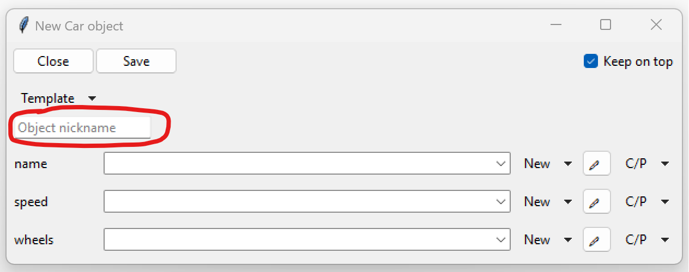

This is how the object will look inside a Combobox, if it is given the name "David's car"
(notice the parentheses at the beginning):

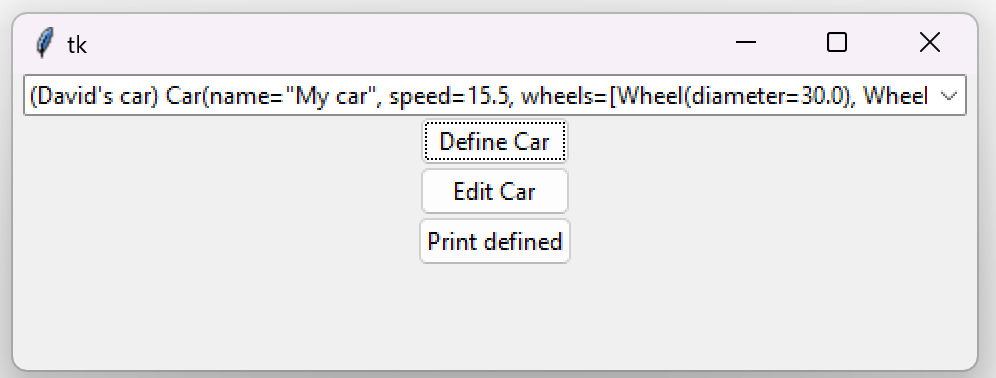

Going down further we can see multiple rows, each one of them corresponding to a parameter.

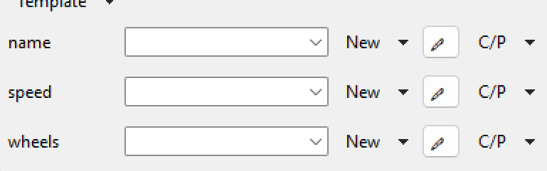

On the left side of our rows, we see labels that contain the name of each individual parameter.
The next item on the right is a Combobox (:class:`~tkclasswiz.storage.ComboBoxObjects`),
which is a dropdown menu used for storing the value of each defined parameter.
This dropdown menu can contain multiple values while we are still editing,
which we can access through the down arrow-like symbol located on the rightmost side of the Combobox.
When the definition frame is closed, all the other (not selected) values get discarded.

.. note::

  While the dropdown menu (Combobox) can contains values manually defined through the GUI,
  it will sometimes have some predefined values. These values can be:

  - None: Parameter was annotated with :class:`typing.Optional` (``Optional[<type>]``) or
    with :class:`typing.Union` (``Union[None, ...]``)
  - ``True`` and ``False``: Parameter is a boolean parameter
  - Literal string values: Parameter is a literal string, meaning it is annotated with
    :class:`typing.Literal`. E. g, ``Literal['value1', 'value2', ...]`` annotation will produce the values 'value1' and
    'value2' inside the Combobox.

    .. code-block:: python

      class Person:
        def __init__(self, name: str, job_type: Literal["Science", "Technology", "Engineering", "Math"]):
            ...

    .. image:: ./images/new_define_frame_struct_literal_values.png
      :width: 15cm

The dropdown menu is followed by 3 buttons:

- "New": is a dropdown menu button, which allows to define multiple data types that the parameter accepts. It can
  also be used to defined other structured data. Clicking on this button will open up a new page (definition frame),
  where the new data type can be defined.
- "<pen icon>": is a button used for editing the selected value inside the dropdown menu. Clicking on this button will open
  up a new page (definition frame), where you can edit the existing value of a parameter.
- "C/P": is a menu button containing 2 options - "Copy" and "Paste". These can be used to copy and paste values from
  other dropdown menus and Listbox (talked about in later chapters) menus.

Now let's define our first ``Car`` object.
We will click the "New" button to define our parameters and select the appropriate data type.
The first parameter is ``name``.
We will click on the "New" button located in the same row as the ``name`` label and select ``str``.

.. image:: ./images/new_define_frame_struct_new_str.png
  :width: 15cm

Defining strings
=====================
Clicking on "New -> str", as seen on the previous picture, will open up a new definition frame (page),
which for strings (``str``) looks different.
Notice we still have the top 3 buttons: Close, Save and Keep on top; however we do not have anything else in common.
There is only one large box into which we can type text.

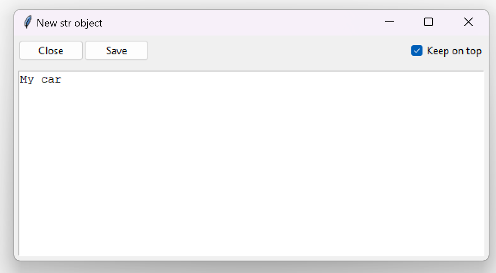

In here we can just type in the text and then click on save, which will save our string into the dropdown menu
(Combobox) located in the same row as the parameter label.

.. image:: ./images/new_define_frame_struct_defined_1_param.png
  :width: 15cm

Defining numbers
===================
We can now define our ``speed`` parameter, which is of type ``float``.
We click on "New ->float" located in the same row as the ``speed`` label, which opens up a new definition frame (page).
which for numbers contains the 3 top buttons and a single line input for the actual numerical input.
In our example case the data type is float, however it will be exactly the same for normal integers.

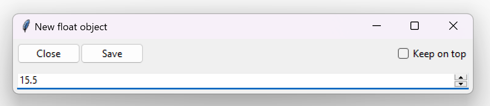

Defining lists
==================
We can now define our ``wheels`` parameter, which is of type ``list[Wheel]``, meaning it is a list of ``Wheel`` objects.
We click on "New ->list" located in the same row as the ``wheels`` label, which opens up a new definition frame (page).
This time around things look quite different. We still have the top 3 buttons, but everything else may seem confusing.

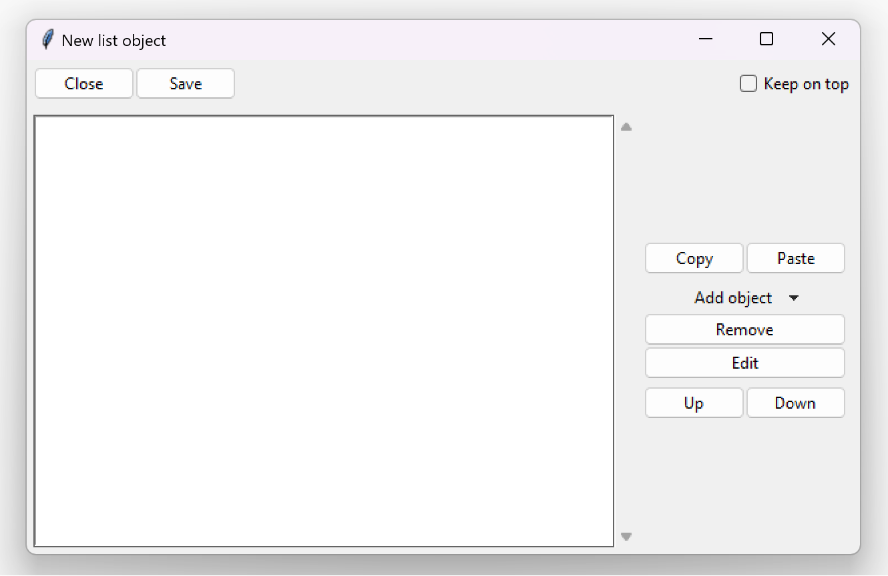

Let's focus on the stuff below the top 3 buttons, which are the same for all data types.
On the left side we can see a giant empty space. This empty space is our Listbox
(:class:`~tkclasswiz.storage.ListBoxObjects`), which is just a list of the elements, that we want our ``list`` to
contain. On the right side we see some buttons:

- Copy and Paste: are used to copying and pasting values into the Listbox.
- Add object: is a menu button with the same function as "New" button in
  :ref:`structured data <Defining structured data (objects)>`. It can be used to select which data type to define
  and then put into the Listbox.
- Edit: is a button used to edit the selected value inside the Listbox.
- Up and down: are used to move the selected Listbox element up or down through the Listbox.

We can now click on Add object and select ``Wheel`` to define a ``Wheel`` object.
This is how our frame looks after defining 4 ``Wheel`` objects:

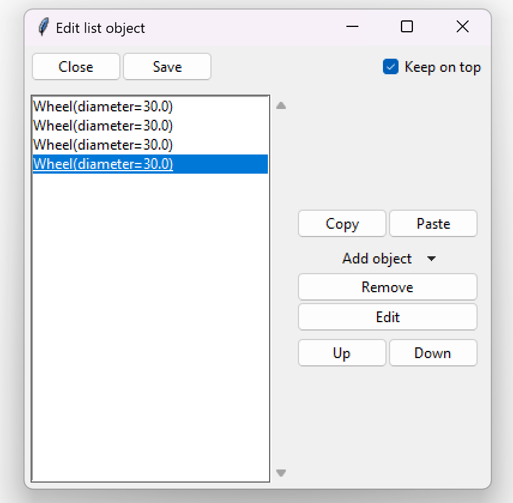

If we click "Save", we go back to our ``Car`` definition frame, that has all the parameters defined.
Clicking on "Save" once again will save the ``Car`` object to our original GUI Combobox.

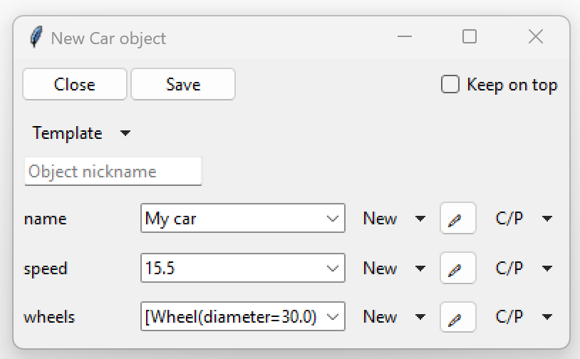

.. image:: ./images/example_gui_view_defined.png
  :width: 15cm

And this is the way to define a ``Car`` object. Of course this example can be extended to other types of classes
and also functions.

Next up we will see how to check if the parameters of an structured objects are valid.
