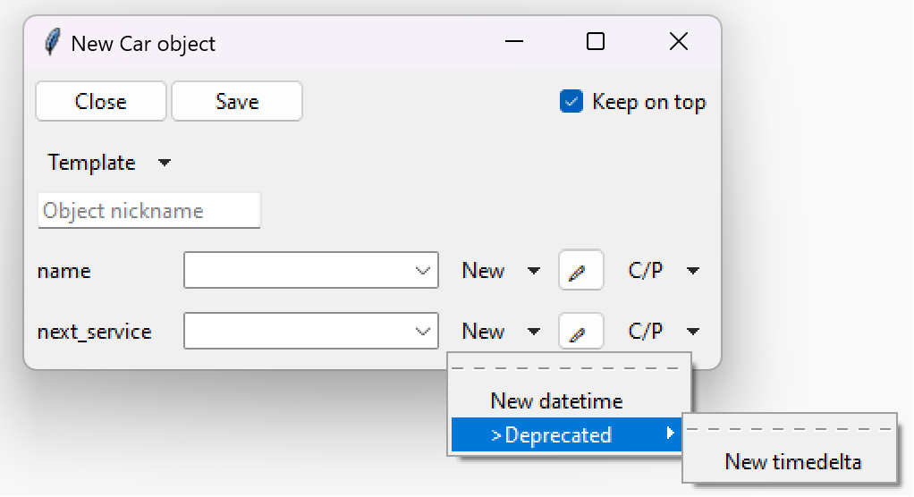

========================
Deprecations
========================

TkClassWizard allows users to deprecate different classes, class's parameters and types under a class's parameter.

All the deprecations can be made with the :func:`tkclasswiz.deprecation.register_deprecated` function.
The function has 3 modes:

- Deprecate class globally (only ``cls`` parameter given)
- Deprecate a class's parameter (``cls`` and ``parameter`` both given)
- Deprecate a type under class's parameter (``cls``, ``parameter`` and ``types`` are all given).
  Please note that ``types`` is a variadic parameter, which means multiple types can be passed by
  just separating them with a comma.

.. code-block:: python
    :caption: Deprecate usage of type :class:`~datetime.timedelta` under parameter ``next_service`` of class ``Car``.

    from datetime import timedelta, datetime
    import tkclasswiz as wiz

    class Car:
        def __init__(self, name: str, next_service: timedelta | datetime):
            ...  # Implementation

    wiz.register_deprecated(Car, "next_service", timedelta)
    ...  # Other needed code

The above example will create the following definition window:

