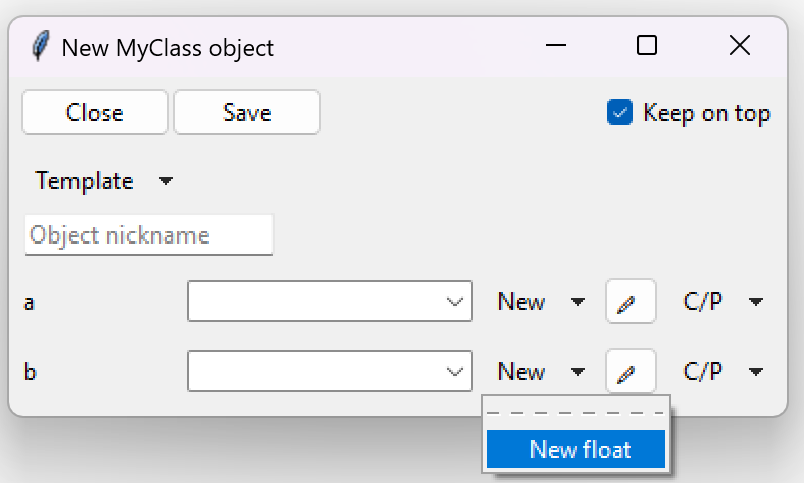

=========================
Generic types (classes)
=========================

A generic type in Python is a class, that inherits the :class:`typing.Generic` class.
It can be used to define arbitrary type parameters, which can be given a value using a subscription operator ``[]``.

Arbitrary types / type variables can be created using the :class:`typing.TypeVar` class.

.. note::
    
    Since Python 3.12, the :class:`typing.TypeVar` no longer requires manual definition
    and can be omitted.

.. code-block:: python
    :linenos:

    from typing import Generic, TypeVar

    T = TypeVar('T')  # From Python 3.12 forward this is optional

    class MyClass(Generic[T]):
        def __init__(self, a: int, b: T):
            ...

    my_instance1: MyClass[float] = MyClass(5, 5.5)
    my_instance2: MyClass[str] = MyClass(5, "Some text")
    my_instance3: MyClass[int] = MyClass(5, 0)

In the above example, the ``T`` is a type variable. It is also a type parameter inside ``MyClass``.
When instances are created, the variables are annotated with a type subscription (e. g., ``MyClass[int]``).

While Python itself doesn't care about the types given in the subscription, and just ignores incorrect types,
TkClassWizard resolves these subscripted types into the ``__init__`` function of a class, allowing the definition
of arbitrary types with the use of type generics.

If we take the above example and pop it into TkClassWizard with ``MyClass`` having a :class:`float` annotation,
we would get the following types in the ``New <type>`` options:

.. code-block:: python
    :caption: Generic type, given :class:`float` as type parameter
    :linenos:
    :emphasize-lines: 21

    from typing import Generic, TypeVar

    import tkclasswiz as wiz
    import tkinter as tk
    import tkinter.ttk as ttk

    T = TypeVar('T')  # From Python 3.12 forward this is optional

    class MyClass(Generic[T]):
        def __init__(self, a: int, b: T):
            ...

    root = tk.Tk("Test")

    combo = wiz.ComboBoxObjects(root)
    combo.pack(fill=tk.X, padx=5)

    def open():
        window = wiz.ObjectEditWindow()  # The object definition window / wizard
        window.open_object_edit_frame(
            MyClass[float],
            combo
        )  # Open the actual frame

    ttk.Button(text="Define", command=open).pack()
    root.mainloop()
