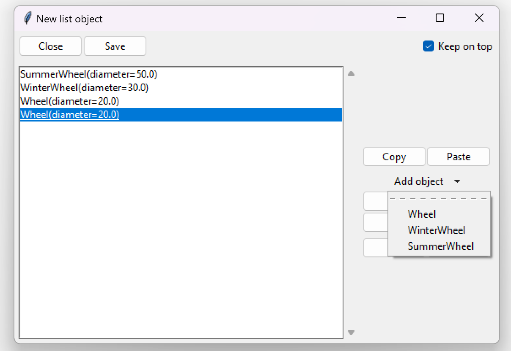

====================================
Polymorphism
====================================

Polymorphism is a term used to describe the phenomenon of something appearing in multiple forms.
In nature an example would be a dog. A dog can appear in different forms (breeds). It also means
that multiple dog forms (breeds) are all derived from a common form - dog.

In the Object Oriented Programming (OOP), this means that an object might appear as either
an instance of a its actual class or an instance of a superclass.

Let's modify our original guide example:

.. code-block:: python
    :linenos:
    :emphasize-lines: 10,11,13,14,22

    import tkinter as tk
    import tkinter.ttk as ttk
    import tkclasswiz as wiz

    # Normal Python classes with annotations (type hints)
    class Wheel:
        def __init__(self, diameter: float):
            self.diameter = diameter

    class WinterWheel(Wheel):
        pass

    class SummerWheel(Wheel):
        pass
        

    class Car:
        def __init__(
            self,
            name: str,
            speed: float,
            wheels: list[Wheel]
        ):
            self.name = name
            self.speed = speed
            self.wheels = wheels

            if speed > 50_000:
                raise ValueError("Car can go up to 50 000 km / h")

            if len(wheels) != 4:
                raise ValueError("The car must have 4 wheels!")

    # Tkinter main window
    root = tk.Tk("Test")

    # Modified tkinter Combobox that will store actual objects instead of strings
    combo = wiz.ComboBoxObjects(root)
    combo.pack(fill=tk.X, padx=5)

    def make_car(old = None):
        """
        Function for opening a window either in new definition mode (old = None) or
        edit mode (old != None)
        """
        assert old is None or isinstance(old, wiz.ObjectInfo)

        window = wiz.ObjectEditWindow()  # The object definition window / wizard
        window.open_object_edit_frame(Car, combo, old_data=old)  # Open the actual frame

    def print_defined():
        data = combo.get()
        data = wiz.convert_to_objects(data)  # Convert any abstract ObjectInfo objects into actual Python objects
        print(f"Object: {data}; Type: {type(data)}",)  # Print the object and it's datatype

    # Main GUI structure
    ttk.Button(text="Define Car", command=make_car).pack()
    ttk.Button(text="Edit Car", command=lambda: make_car(combo.get())).pack()
    ttk.Button(text="Print defined", command=print_defined).pack()
    root.mainloop()

We can see that two new classes are created - ``WinterWheel`` and ``SummerWheel``.
We also see that ``Car``'s ``wheels`` parameter is still a list of type ``Wheel``.
TkClassWizard not only considers the annotated type when constructing a GUI, but also the annotated type's subclasses,
implementing the concept of polymorphism, thus allowing us definition of
``Wheel``, ``WinterWheel`` and ``SummerWheel`` classes.

