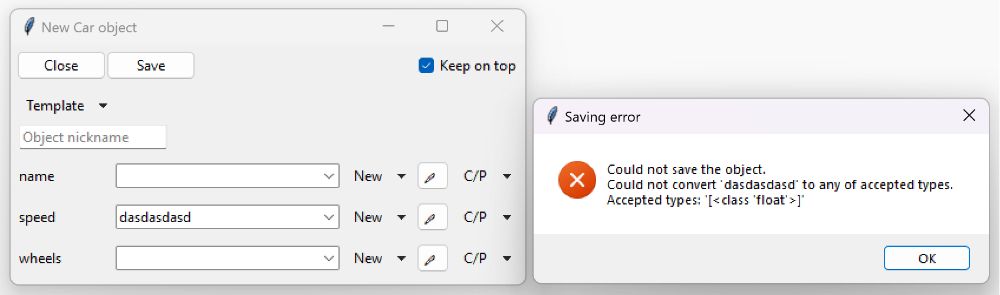
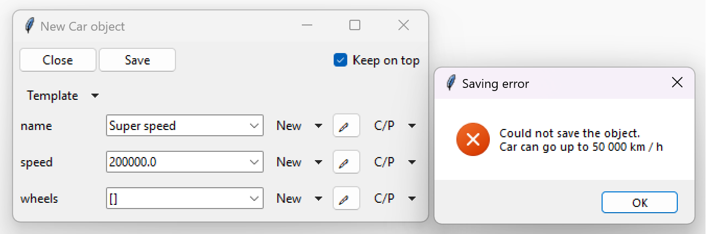
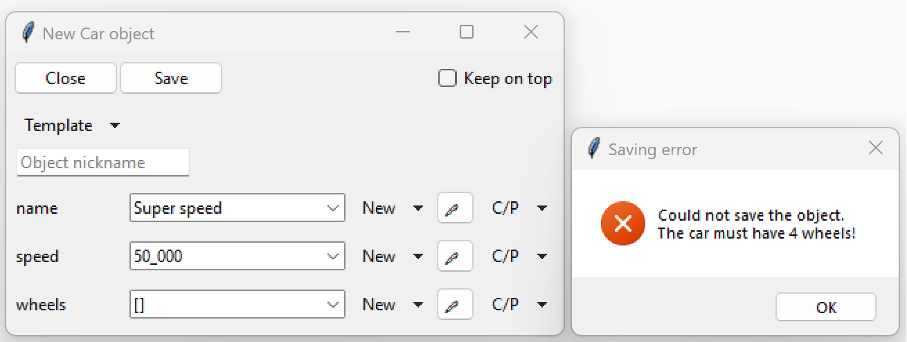

=============================
Parameter validation
=============================

Validation is the process of checking whether everything is defined as intended.
TkClassWizard defines 2 different types of built-in validation and additionally allows custom user defined
validation.

Built-in validation
====================

Data type validation
---------------------

When you click on "Save" inside the object definition window or try to edit a value, the system will attempt
to convert the entered value to one of the appropriate annotated data types if it is not already of correct type.
For example if number is manually entered directly into a Combobox, it may try to convert the entered string into
an actual :class:`int` type, that is if int is one of the annotated types. Casting will only be done into built-in
Python data types and not any user defined classes.
If casting fails (either no built-in types available or casting actually failed),
an exception will be displayed through a popup, as shown in the following image.

Literals validation
--------------------

Validation is also done for string literals.
The system will check if any of the parameters are a string literal and if the entered content matches
any of the literal values.
For example if we have a class defined like the below code block, then the parameter ``job_type`` will be validated.
If the value entered for ``job_type`` does not match the ones inside the ``Literal`` brackets,
an exception will be displayed on screen.

.. code-block:: python

    class Person:
        def __init__(self, name: str, job_type: Literal["Science", "Technology", "Engineering", "Math"]):
            ...

.. image:: ./images/new_define_frame_struct_literal_error.png
    :width: 15cm

User-defined validation
==========================

.. note::

    When using the *Template* feature (described in :ref:`Defining structured data (objects)`),
    user-defined validation is not executed.

It is also possible for users to define their own custom validation.
This can be done quite easily with the use of Python **exceptions**.
Every time the data is saved, the object definition window tries to create a Python object and then caches
that object to prevent recursive creations.
This allows users to check all of the parameters with their own Python code and then raise an
appropriate exception when an irregularity appears.

If we take our example from :ref:`First steps`, we can add user defined validation like displayed below.

.. code-block:: python
    :linenos:
    :emphasize-lines: 16, 17, 19, 20

    import tkinter as tk
    import tkinter.ttk as ttk
    import tkclasswiz as wiz

    # Normal Python classes with annotations (type hints)
    class Wheel:
        def __init__(self, diameter: float):
            self.diameter = diameter

    class Car:
        def __init__(self, name: str, speed: float, wheels: list[Wheel]):
            self.name = name
            self.speed = speed
            self.wheels = wheels

            if speed > 50_000:
                raise ValueError("Car can go up to 50 000 km / h")

            if len(wheels) != 4:
                raise ValueError("The car must have 4 wheels!")

    # Tkinter main window
    root = tk.Tk("Test")

    # Modified tkinter Combobox that will store actual objects instead of strings
    combo = wiz.ComboBoxObjects(root)
    combo.pack(fill=tk.X, padx=5)

    def make_car(old = None):
        """
        Function for opening a window either in new definition mode (old = None) or
        edit mode (old != None)
        """
        assert old is None or isinstance(old, wiz.ObjectInfo)

        window = wiz.ObjectEditWindow()  # The object definition window / wizard
        window.open_object_edit_frame(Car, combo, old_data=old)  # Open the actual frame

    def print_defined():
        data = combo.get()
        data = wiz.convert_to_objects(data)  # Convert any abstract ObjectInfo objects into actual Python objects
        print(f"Object: {data}; Type: {type(data)}",)  # Print the object and it's datatype

    # Main GUI structure
    ttk.Button(text="Define Car", command=make_car).pack()
    ttk.Button(text="Edit Car", command=lambda: make_car(combo.get())).pack()
    ttk.Button(text="Print defined", command=print_defined).pack()
    root.mainloop()

This is how our exceptions look when we try to define a car which's speed is above 50 000 km/h and
which's wheel count is not four:

